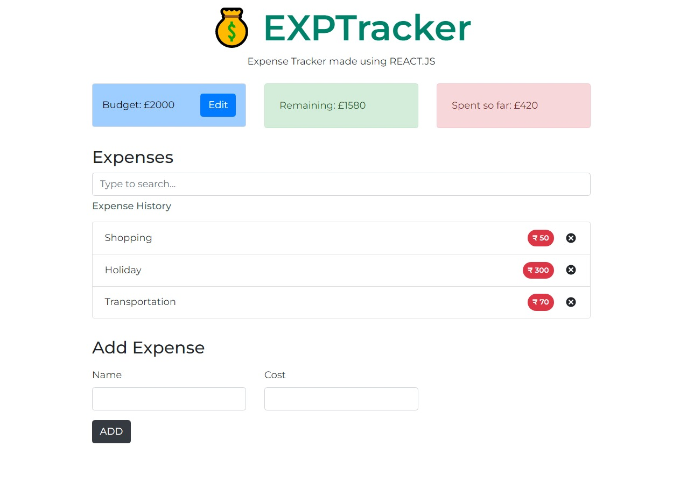

# EXPTRACK-REACT

This is a **Expense / Budget Tracking Application** which is fully made using REACT Framework. It has some features like setting a budget and adding expenses according to the budget.

##### ⭐ Implemented

- React Functional Components
- React Redux (state management)
- Bootstrap for basic UI Styling.

##### ⭐ Instruction to use the application

1. clone the repository _git clone_
2. Install the Node Dependency using _npm install_
3. Run the App _npm start_
4. Set the Budget, in the application
5. After that you can add Expenses to see the workings

##### ⭐ Screenshot (Demo)

